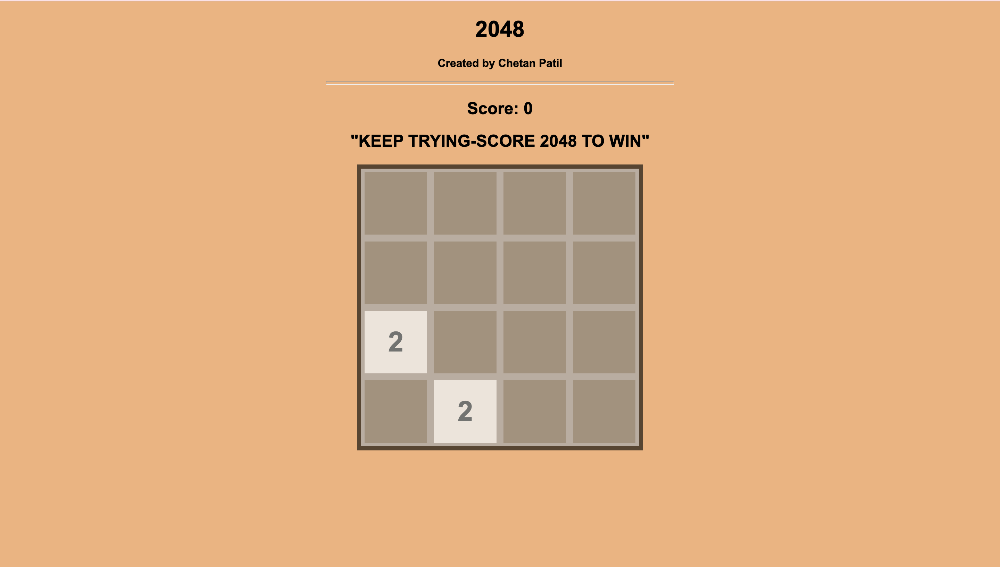

# 2048 GAME

- click Here to see live webpage [https://git0chetan.github.io/2048_GAME/]
- my github profile: [https://github.com/Git0Chetan]

# Need of 2048 Game
Concepts of js got better while developing the project.
While playing these game , It boosts both pleasure and perseverance, while decreasing stress.

# Instruction
2048 is played on a 4×4 grid, with numbered tiles that slide smoothly when a player moves them using the four arrow keys. Each time you slide, a new tile will randomly appear in an empty spot on the board. Tiles slide as far as possible in the chosen direction until they are stopped by either another tile or the edge of the grid. If two tiles of the same number collide while moving, they will merge into a tile with the total value of the two tiles that collided. The resulting tile cannot merge with another tile again in the same move.
If you score 2048 or more You will win the Game.

# Tech Used
- **HTML** - To structure the web page and its content.
- **CSS**- To style and layout web page
- **JS** - To make web pages interactive and to create dynamically updating content, use animations, pop-up menus, clickable buttons, etc

# How to Run The game on personal PC
- you can go to the live link provided above or
- clone the project and run the index.html file.

# Start

# winner

