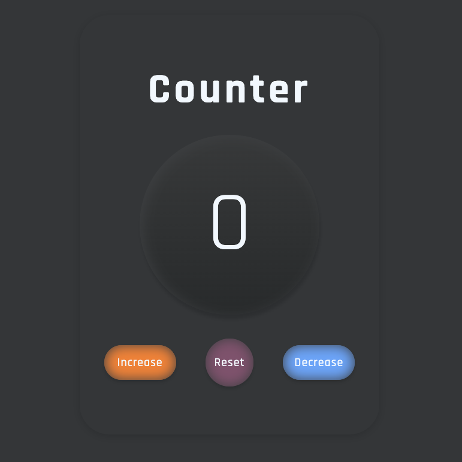

# Counter Application

This is a simple counter application built using HTML, CSS, and JavaScript. It allows you to increase, decrease, and reset a counter value.

## Table of Contents

- [Demo](#demo)
- [Features](#features)
- [Getting Started](#getting-started)
- [Usage](#usage)

## Demo



## Features

- Increase the counter value by clicking the "Increase" button.
- Decrease the counter value by clicking the "Decrease" button.
- If value is 0 counter stops to decreasing it.
- Reset the counter value to 0 by clicking the "Reset" button.

## Getting Started

To use the Counter App, follow these steps:

### Installation

1. Clone the repository (requires Git) or download the ZIP file.

```bash
git clone https://github.com/Prodigy-InfoTech/Web-Development-Projects.git
```

2. Open the project folder.

```bash
cd Counter
```

3. Open the index.html file in your web browser.

## Usage

1. Open the index.html file in your web browser.
2. You will see the counter app with three buttons: "Increase" "Decrease" and "Reset"
3. Click the "Increase" button to increase the counter value.
4. Click the "Decrease" button to decrease the counter value (it won't go below 0).
5. Click the "Reset" button to reset the counter value to 0.
