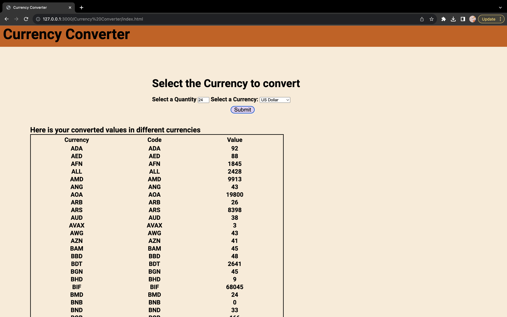

# Currency Converter using HTML/CSS/JS

A currency converter is a software application or website that provides for the easy conversion of currency values based on present-day exchange rates.

# Sample Solution



# Process of Conversion

- Enter an amount which you want to convert.
- Choose the Currency from which you wish to convert the currency from.
- Click on Submit button to fetch the data of currency, along with their codes, according to current rates.

# Installation Process


1. Clone the repository.

```bash
git clone https://github.com/Prodigy-InfoTech/Web-Development-Projects.git
```

2. To open the Currency Converter folder->

```bash
cd Currency Converter
```

3. Run `index.html`.