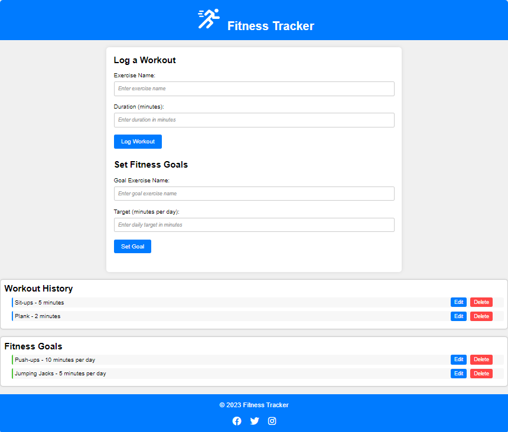

# Fitness Tracker

Welcome to the README for the **Fitness Tracker** project! This document will help you get started and understand the key features of your project.



## Table of Contents
- [Introduction](#introduction)
- [Features](#features)
- [Getting Started](#getting-started)
  - [Prerequisites](#prerequisites)
  - [Installation](#installation)
- [Usage](#usage)

## Introduction

The **Fitness Tracker** is a simple Web App that allow users to log their workouts and set fitness goals online. It provides an easy and intuitive interface for adding, editing, and organizing workouts and goals. If you need a basic Fitness Tracker for tracking your personal fitness goals, this website has you covered.

## Features

- User-friendly interface for tracking fitness log and goals.
- Create multiple workouts & goals to track your fitness.
- Add, edit, and delete workouts & goals as needed.
- Mobile-responsive design suitable to use on various devices.

## Getting Started

### Prerequisites

A latest Web browser like Chrome, Firefox, Safari, Edge, etc.

### Installation

1. Clone the repository to your local machine:

   ```bash
   git clone <project link>

2. Open the project folder.

```bash
cd <project address>
```

3. Run `index.html` in your preferred web browser.

## Usage

1. Open the `index.html` file.
2. Enter you Exercise Name and duration.
3. Click on the "Log Workout" button.
4. Enter you Goal Exercise and duration.
5. Click on the "Set Goal" button.
6. You can edit or delete your exercise history and goals.
---
