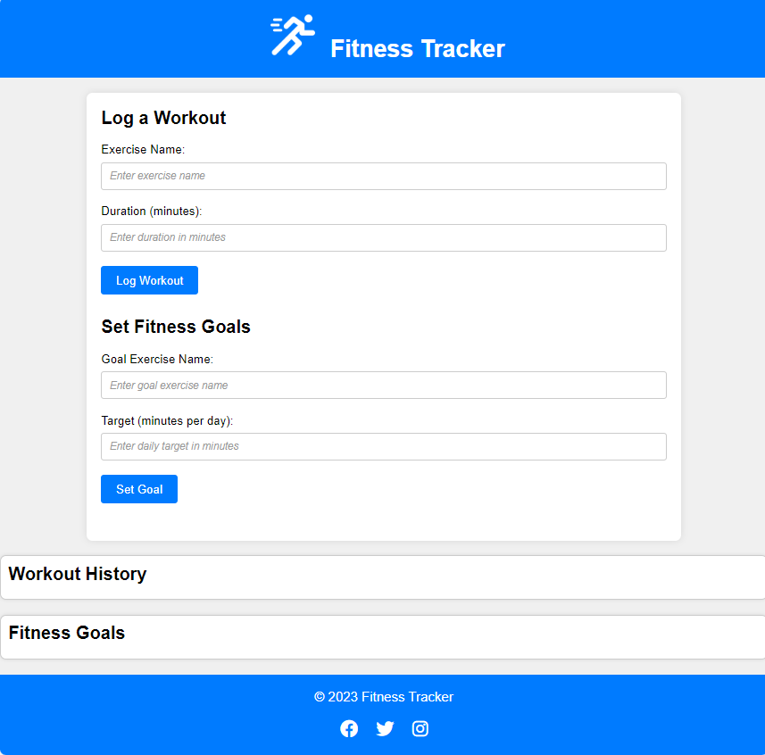

# Fitness Tracker

Welcome to the README for the **Fitness Tracker** project! This document will help you get started and understand the key features of your project.

## Table of Contents
- [Introduction](#introduction)
- [Features](#features)
- [Getting Started](#getting-started)
  - [Prerequisites](#prerequisites)
  - [Installation](#installation)
  - [Configuration](#configuration)
- [Usage](#usage)

## Introduction

The **Fitness Tracker** is a simple Web App that allow users to log their workouts and set fitness goals online. It provides an easy and intuitive interface for adding, editing, and organizing workouts and goals. If you need a basic Fitness Tracker for tracking your personal fitness goals, this website has you covered.

## Features

List the key features of your project in this section. You can use bullet points for better readability.

- Feature 1: Describe feature 1 here.
- Feature 2: Describe feature 2 here.
- ...

## Getting Started

This section should guide users on how to get started with your project. Include instructions for installation, configuration, and any prerequisites.

### Prerequisites

List any prerequisites that users need to have installed or set up before they can use your project.

### Installation

Provide installation instructions, code examples, or scripts if necessary.

### Configuration

Explain any configuration options or settings that the user may need to modify.

## Usage

In this section, provide examples and instructions on how to use your project. You can include code snippets, screenshots, and any other helpful information.

## License

This project is licensed under the [License Name](LICENSE.md) - You can provide a link to the full license text if needed.
