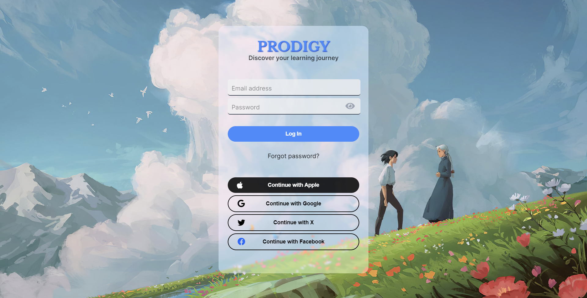

# Login Page Project

This project is a simple login page created using HTML, CSS, and a bit of JavaScript. It also uses Font Awesome for button icons.



## Table of Contents

- [Introduction](#introduction)
- [Features](#features)
- [Getting Started](#getting-started)
  - [Prerequisites](#prerequisites)
  - [Installation](#installation)
- [Usage](#usage)
- [Contributing](#contributing)
- [License](#license)
- [Acknowledgments](#acknowledgments)

## Introduction

This project aims to provide a basic login page for web applications. It's designed with HTML and CSS, with minimal JavaScript. The use of Font Awesome icons enhances the visual appeal of the login buttons.

## Features

- User-friendly login form.
- Stylish buttons with Font Awesome icons.

## Getting Started

Follow these instructions to get the login page up and running on your local machine.

### Prerequisites

You need a web browser to run this project.

### Installation

1. Clone this repository:

   ```bash
   git clone https://github.com/Prodigy-InfoTech/Web-Development-Projects.git or
   git clone https://github.com/rhnas110/Web-Development-Projects.git
   ```

   Navigate to the project directory:

   ```bash
   cd .\Web-Development-Projects\Login Page\ or
   cd .\your-folder-create\Login Page\
   ```

2. Open the index.html file in your web browser.

3. If you find this project useful, please consider the following:

- Follow on GitHub: Click the "Follow" button on the GitHub project page to stay updated with the latest developments.
- Star the project: Click the "Star" button on the GitHub project page to show your appreciation and support.

### Usage

- Open the index.html file in your web browser.

### Contributing

If you'd like to contribute to this project, please follow these guidelines:

- Fork the repository.
- Create a new branch.
- Make your changes.
- Test your changes thoroughly.
- Submit a pull request with a clear description of your changes.

Your support is greatly appreciated! Thank you for contributing to the project.

### License

.

### Acknowledgments

- Font Awesome for providing the icons used in this project.
- The background image used in this project is sourced from [Unsplash](https://unsplash.com).
- This project was inspired by the design and concept of the [Pixiv](https://www.pixiv.net/) website.
