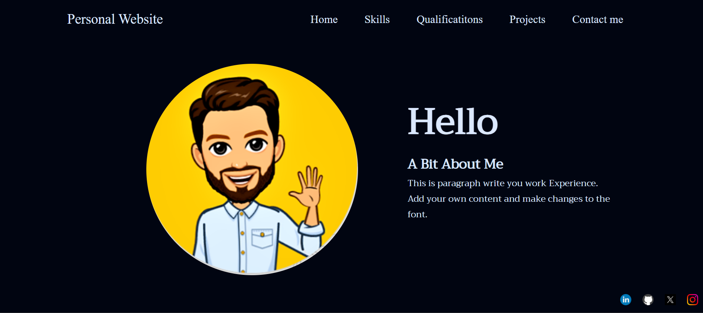

# Personal Website -

Portfolio website built using Html, Css and Javascript

This website is built to showcase my technical skills, web design skills.

# Technologies Used -

1) HTML5
2) CSS3
3) JavaScript

# Content -

1) Home Page 
2) Skills
3) Qualifications
4) Projects
5) Contact me

# Homepage Visuals -

# Features

- Can hold Information about you.
- Can hold your Qualifications,Projects and Work Experience.
- If some want to connect to you, a mail can be sent to your email.

