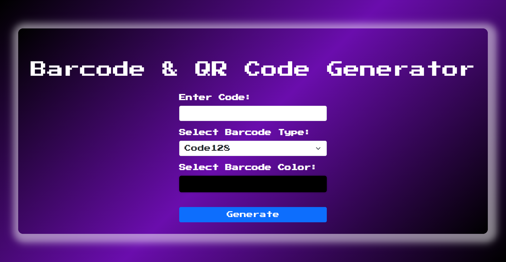

# Barcode Generator

This project is a web-based application that allows users to generate barcodes and QR codes. The application is built using Flask (Python) for the backend, and HTML/CSS for the frontend. Users can input text and select a barcode type to generate and download the corresponding barcode or QR code image.



## Features

- **Generate Barcodes**: Supports different types of barcodes including QR Code, Code 128, EAN-13, and UPC-A.
- **Customizable Colors**: Users can select the color of the barcode or QR code.
- **Image Download**: The generated barcode or QR code can be downloaded directly as a PNG image.

## Technologies Used

- **Python**: Backend logic and barcode generation using the Flask framework.
- **Flask**: Web framework used to serve the application.
- **HTML/CSS**: Frontend interface design.
- **qrcode**: Python library for generating QR codes.
- **python-barcode**: Python library for generating barcodes.

## Installation and Setup

### Prerequisites

- Python 3.x
- pip (Python package manager)

### Installation Steps

1. **Clone the Repository**:
   ```bash
   git clone https://github.com/yourusername/barcode-generator.git
   cd barcode-generator
2. **Install Dependencies: Install the required Python packages using pip:**

   ```bash
    pip install flask qrcode[pil] python-barcode Pillow
3. **Run the Application: Start the Flask server:**

   ```bash
   python app.py
4. **Access the Application:** Open your web browser and navigate to http://127.0.0.1:5000/ to use the barcode generator.

## Usage

- **Input the Code:** Enter the text or code that you want to generate as a barcode or QR code.
- **Select Barcode Type:** Choose from QR Code, Code 128, EAN-13, or UPC-A.
- **Choose a Color:** Pick a color for the barcode or QR code using the color picker.
- **Generate and Download:** Click the "Generate Barcode" button. The barcode or QR code will be generated and downloaded as a PNG image.
## File Structure
```plaintext
   barcode-generator/
   │
   ├── templates/
   │   └── index.html       # HTML file for the frontend interface
   │
   ├── app.py               # Main application file containing Flask routes and logic
   │
   └── README.md            # This README file
```
## Troubleshooting
- **Missing Libraries:** Ensure all required Python packages are installed using pip install -r requirements.txt.
- **Port Issues:** If the default port 5000 is already in use, change the port in app.py by updating the app.run() function.
## Contributing
Contributions are welcome! If you find any issues or have ideas for improvements, feel free to create an issue or submit a pull request.