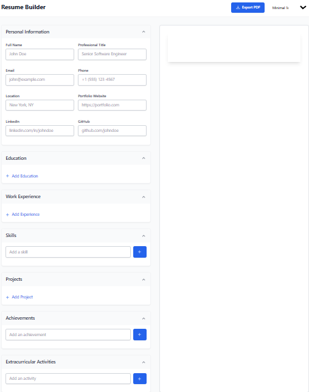
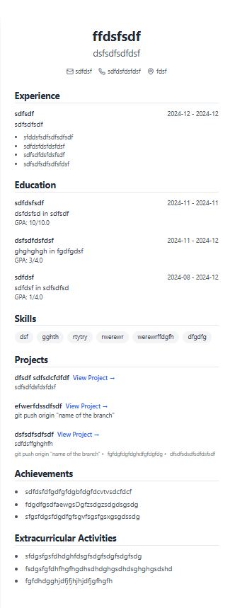

# Resume Generator

Welcome to the Resume Generator project! This application allows users to create professional resumes quickly and easily.

## Table of Contents
- [Features](#features)
- [Installation](#installation)
- [Usage](#usage)
- [Screenshots](#screenshots)
- [Customization](#customization)
- [Contributing](#contributing)
- [License](#license)

## Features

- User-friendly interface for inputting personal information
- Templates for different job sectors
- Option to download resumes in PDF format
- Ability to edit and save resumes for later use
- Responsive design for use on multiple devices

## Installation

To set up the Resume Generator locally, follow these steps:

### Step 1: Clone the Repository

Open your terminal and run the following command:

```bash
git clone https://github.com/your-username/resume-generator.git
```

### Step 2: Navigate to the Project Folder

Change directory to the project folder:

```bash
cd resume-generator
```

### Step 3: Install Dependencies

Install the necessary dependencies using npm:

```bash
npm install
```

### Step 4: Start the Application

After the dependencies are installed, start the application:

```bash
npm start
```

### Step 5: Open in Browser

Open your web browser and navigate to `http://localhost:3000` to use the Resume Generator.

## Usage

After the application starts, follow these steps:

1. Fill out the required fields with your information.
2. Choose your preferred resume template.
3. Preview your resume and make any necessary edits.
4. Download your resume as a PDF file when satisfied.

## Screenshots

Here are a few screenshots of the application in action:

 **Website Dashboard:**
   
   
   


## Contributing

We welcome contributions! If you'd like to help improve the Resume Generator, please follow these steps:

1. Fork the repository.
2. Create a new branch for your feature or bug fix:
   ```bash
   git checkout -b feature/YourFeature
   ```
3. Make your changes and commit them:
   ```bash
   git commit -m "Add your message here"
   ```
4. Push to the branch:
   ```bash
   git push origin feature/YourFeature
   ```
5. Create a pull request.

---

Thank you for using the Resume Generator! 
```

GitHub Link: https://github.com/yashwanthvarma18

Deployed Website Link: https://resume-builder123456.netlify.app/