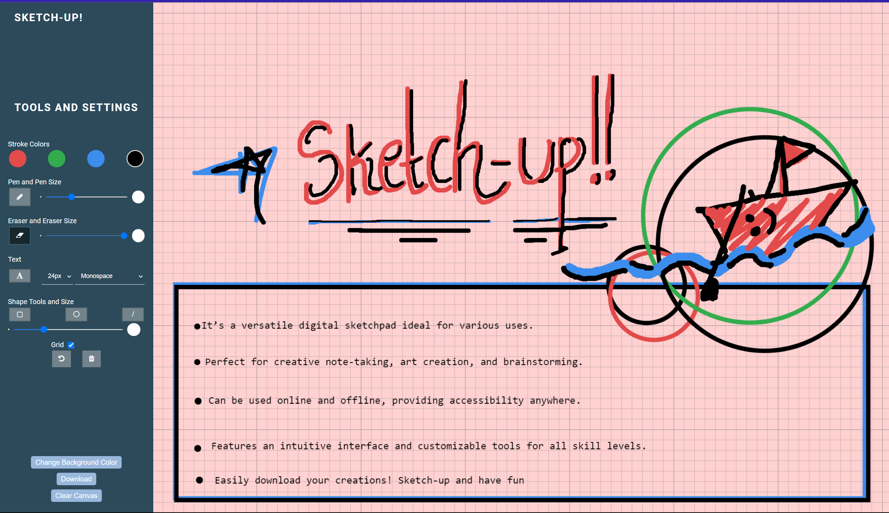
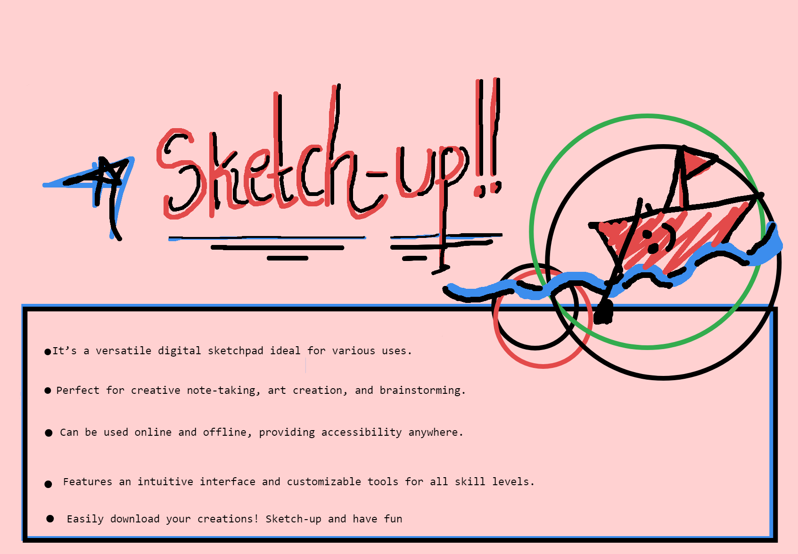

# Sketch-Up 🎨

Click here to see the live webpage: https://varunrmantri23.github.io/Sketch_Up/
My GitHub profile: https://github.com/varunrmantri23

## Need for Sketch-Up

The Sketch-Up project was born out of a need for a versatile digital sketchpad that could cater to various needs such as note-taking, drawing, and more. It's an all-in-one solution for users seeking a digital platform to express their creativity and capture their ideas.

## Instructions 📝

Sketch-Up is designed with an intuitive interface that's easy to navigate. It features a variety of tools including pencils, erasers, text tools, shape tools, and more. Users can customize the color and line thickness according to their preference. The main canvas area is where users can draw or jot down their ideas. The creations can be easily downloaded for future reference.

## Tech Used 💻

-   **HTML** - To structure the web page and its content.
-   **CSS** - To style and layout the web page.
-   **JavaScript** - To make the web page interactive and to create dynamically updating content.

## How to Run The Application on Personal PC 🏃‍♂️

You can go to the live link provided above or clone the project and run the index.html file on your local pc.

Enjoy using Sketch-Up and let your creativity flow!

## User Interface

## Downloaded Image

You can contact varunrmantri23@gmail.com for any suggestions or feedback! Thank you
