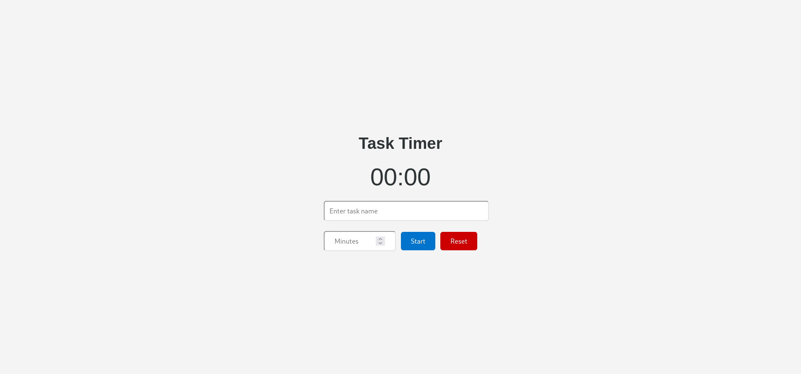

Certainly, here's a sample README file for your Task Timer web app, inspired by the reference README you provided:

# Task Timer 🕒

[Live Demo](https://task-timer-efe4.onrender.com)

## Overview 📝

Task Timer is a simple web application that allows users to track work or study sessions with customizable intervals and a visual timer display. Whether you need to manage your work hours, study sessions, or any other time-based tasks, Task Timer provides an easy-to-use solution.

## Features 🚀

- **Customizable Timer**: Set your desired time for work or study sessions.
- **Visual Timer Display**: See the countdown timer in a user-friendly format.
- **Pause and Resume**: Pause and resume your sessions as needed.
- **Task Name**: Assign a name to your task to keep your focus.
- **Reset Functionality**: Start a new session or change your settings easily.

## How to Use Task Timer 📖

1. **Set the Task Name**: Enter the name of the task you want to work on.
2. **Specify Time**: Input the number of minutes you plan to dedicate to the task.
3. **Start Timer**: Click the "Start" button to begin the timer countdown.
4. **Pause and Resume**: Use the "Pause" button to temporarily stop the timer, and the "Resume" button to continue.
5. **Reset**: To start a new session or adjust settings, click the "Reset" button.

## Technologies Used 💻

- **HTML**: Used for structuring the web page and content.
- **CSS**: Applied for styling and layout.
- **JavaScript**: Implemented to create an interactive and dynamically updating timer.

## User Interface 🖼️

